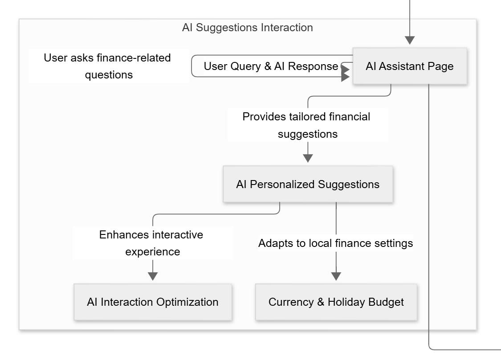
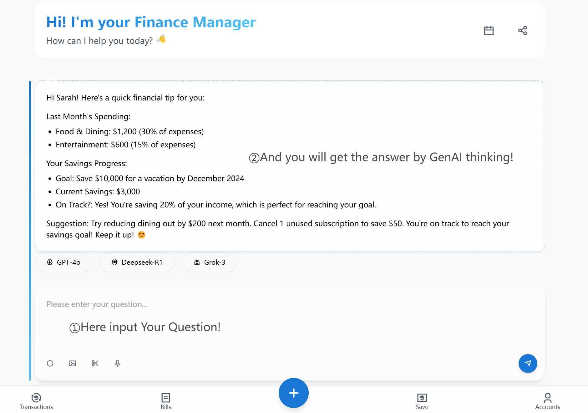

# Story Writing Workshop

# 1. User Story

**Xiao Li’s Financial Journey: From Chaos to Control**

### **1. Background: A Fresh Start with Financial Struggles**

Xiao Li, a 23-year-old recent college graduate, landed his first job in a bustling Chinese city with a monthly salary of 8,000 yuan. Excited to step into adulthood, he soon realized that managing money wasn’t as simple as he’d thought. By the end of each month, his bank account was nearly empty, leaving him puzzled and stressed. With payments scattered across WeChat, Alipay, and his bank card, Xiao Li had no clear picture of where his money went. He wanted to save for a new laptop and a trip home for the Spring Festival, but without a plan, his goals felt out of reach. Hoping for a smarter solution, he turned to an AI-powered personal financial tracker recommended by a friend.

---

### **2. Pain Points: A Rookie’s Financial Struggles**

Xiao Li faced several challenges:

- **Fragmented Spending**: His transactions were a mess—WeChat for street food, Alipay for online shopping, and his bank card for rent and utilities. Tracking it all felt impossible.
- **Mystery Overspending**: He often splurged without realizing it—weekend movies, late-night takeout, and impulsive Taobao purchases added up fast.
- **Savings Confusion**: He dreamed of saving 2,000 yuan a month, but didn’t know how to start or balance it with daily expenses.
- **AI Curiosity**: Xiao Li had heard about AI from tech-savvy classmates, but wasn’t sure how it could help him manage his wallet.

---

### **3. Solution: The AI Tracker Steps In**

One evening, Xiao Li downloaded the AI financial tracker app, determined to take control. Here’s how it transformed his financial life:

> **Day 1: Getting Started with Automatic Data Import**
> 

Xiao Li linked his WeChat, Alipay, and bank card accounts to the app. Within minutes, the AI imported a month’s worth of transactions—350 yuan on bubble tea, 1,200 yuan on rent, 800 yuan on a new jacket. The app categorized them into “Dining,” “Housing,” and “Shopping.” He was amazed at how fast it worked but noticed a glitch: a 50-yuan payment for a group dinner was tagged as “Entertainment” instead of “Dining.” He manually corrected it, and the AI noted his preference for future transactions.

**Decision Point**: Xiao Li hesitated—should he spend time fixing every small error? He decided to trust the AI to learn over time, saving him effort.

> **Week 1: Budget Setup and First Insights**
> 

The AI analyzed his 8,000-yuan income and suggested a budget: 2,000 yuan for rent, 1,500 yuan for dining, 500 yuan for transportation, 1,000 yuan for entertainment, and 1,000 yuan for shopping, leaving 2,000 yuan to save. Xiao Li grinned—his laptop fund was finally within reach! But the AI flagged his weekend spending: “You spent 600 yuan on entertainment last Saturday—movies and KTV. Consider cutting back.” Xiao Li thought it over. Those nights out with colleagues were his way to bond at his new job.

**Decision Point**: He adjusted the entertainment budget to 1,200 yuan, reducing shopping to 800 yuan. The AI recalculated, lowering his savings to 1,800 yuan. Xiao Li felt in control—he could socialize and still save.

> **Week 2: Manual Input and AI Learning**
> 

One day, Xiao Li paid 200 yuan in cash for a second-hand bike—a rare offline purchase. The app didn’t catch it, so he manually entered it as “Transportation.” The AI asked, “Is this a one-time expense or recurring?” Xiao Li selected “one-time,” and the app adjusted his budget without penalizing his savings. Over time, the AI started recognizing patterns—like his 30-yuan weekly subway top-up—and auto-classified them perfectly.

**Interaction**: Xiao Li asked the app, “How much can I spend on takeout this week?” The AI replied, “You’ve used 300 of your 1,500-yuan dining budget. You can spend 200 more on takeout.” He ordered dumplings that night, staying on track.

> **Month 2: Localized Advice and Forecasting**
> 

As November rolled in, the AI sent a notification: “Spring Festival is 3 months away. Based on last year’s trends, travel and gifts may cost 3,000 yuan. Start saving 1,000 yuan monthly now.” Xiao Li hadn’t even thought that far ahead! The app also predicted a spike in dining costs based on his Singles’ Day shopping spree last year, suggesting he cook more at home.

**Decision Point**: Xiao Li agreed to save extra for the festival but ignored the cooking advice—he loved his late-night skewers too much. The AI adapted, tweaking his dining budget instead.

---

### **4. Interaction: Xiao Li and the AI Grow Together**

- **Suggestions vs. Choices**: When the AI suggested cutting transportation costs by biking more, Xiao Li explained in the app’s feedback box, “I need the subway for rainy days.” The AI stopped pushing and focused on other areas.
- **Corrections That Teach**: After the AI mislabeled a 100-yuan gift as “Shopping,” Xiao Li corrected it to “Gifts.” The next month, a similar expense was tagged correctly—proof the AI was learning.
- **Budget Flexibility**: In December, Xiao Li’s friend got married, costing him a 500-yuan hongbao. He updated the budget, and the AI shifted funds from entertainment, preserving his savings goal.

---

### **5. Result: A Confident Money Manager**

By March 20, 2025, Xiao Li’s financial chaos was history. He’d saved 5,400 yuan—enough for a mid-range laptop—and had 1,000 yuan tucked away for Spring Festival. The app’s insights revealed he spent 25% of his income on dining, prompting him to cook occasionally. With the AI’s localized tips, like avoiding holiday overspending, he felt ready for China’s fast-paced consumer life. Xiao Li wasn’t just surviving month-to-month anymore—he was thriving, with a clear view of his money and goals.

# 2. Personas

### 1. Office Workers

**Needs:**

- **Budget Management:** Office workers often face the challenge of planning their monthly income and expenses, especially for fixed costs such as rent and loans. They need tools to track their expenses and ensure they don't exceed their budget.
- **Financial Reminders and Forecasting:** Workers need reminder tools to help them pay bills on time, and also want to see future expense forecasts to prepare in advance.
- **Spending Analysis and Optimization:** Based on past spending data, provide suggestions for saving or feedback on spending habits, helping workers save without affecting their quality of life.

**Pain Points:**

- **Time Pressure:** The busy nature of work can cause employees to neglect financial management and make it difficult to regularly track bills and expenses.
- **Complex Financial Planning:** Workers need tools to simplify complex financial analysis and automate categorization, reducing manual work.

### 2. Students

**Needs:**

- **Budget Setting and Expense Tracking:** Students mostly rely on allowances from parents or part-time jobs. They need help planning monthly living expenses, tuition fees, and other costs.
- **Savings Goals:** Students usually have short-term savings goals, such as purchasing electronic devices or traveling. They want financial management tools to help them achieve these goals.
- **Spending Analysis During Financial Tightness:** Students often face financial constraints and need to understand where they can reduce spending, especially in non-essential categories.

**Pain Points:**

- **Limited Income, High Expenses:** Students face the challenge of having limited income while managing various expenses, especially for tuition and living costs.
- **Lack of Financial Knowledge:** Many students lack sufficient financial knowledge, making it difficult for them to plan budgets or handle unexpected expenses.

### 3. Business Owners

**Needs:**

- **Financial Automation:** Business owners need more complex financial tools to help automate the management of income and expenses, particularly for company operations.
- **Cash Flow Analysis and Forecasting:** They need to see financial trends for the upcoming months and predict potential cash shortages or surpluses.
- **Tax and Compliance:** Business owners need tools to ensure their financial activities comply with regulations and help them prepare tax reports.

**Pain Points:**

- **Time Management:** Business owners often face the challenge of managing both time and finances, needing a convenient tool to reduce manual calculations and focus on decision-making.
- **Complex Financial Analysis:** Business finances are complex, requiring customized tools to detail financial reports covering costs, revenues, employee salaries, etc.

# 3. User Flow

The User Flow illustrates the interaction path users take when navigating through our finance management system. It includes transaction management, bill management, savings planning, budget settings, and AI-assisted suggestions.

### **3.1 Home Page & Navigation**

> Users start at the Welcome Page, from which they can navigate to different features including transactions, bills, savings, accounts, and AI assistance.
> 

### **3.2 Transaction Management**

> Users can manually add a new transaction.Transactions can be imported from a CSV file or synced from a bank account.The system categorizes transactions and provides spending insights.
> 

### **3.3 Bill Management**

> Users can add new bills and set due dates.Bills can be marked as paid once completed.AI provides payment reminders and spending trends.
> 

### **3.4 Savings Plan Management**

> Users can create new savings plans.The system tracks savings progress and provides recommendations.
> 

### **3.5 Budget & Account Settings**

> Users can set a monthly budget and view financial summaries.The system provides customizable account settings.
> 

### **3.6 AI-Assisted Finance Advice**

> Users can interact with an AI Assistant for financial tips.The system analyzes user behavior and provides personalized recommendations.
> 

### **Key Features**

- Users receive **personalized AI financial suggestions** based on their spending habits.
- The system **adapts to local financial environments**, considering **currency settings** and **holiday budget adjustments**.
- AI analyzes **transaction patterns** and **recommends spending optimizations**.

### **Customization of Local Financial Environment**

The system allows users to **customize financial settings** to better align with their local economic environment. Users can:

- Select **currency units** to reflect their region’s financial system.
- Adjust **holiday budget planning** to accommodate seasonal variations in spending behavior.

### **AI Personalized Suggestions**

AI provides **tailored financial recommendations** based on spending patterns. The system:

- Analyzes **historical transactions** to detect trends.
- Suggests **spending optimizations** and budget allocations.
- Notifies users of **potential cost-saving opportunities**, such as reducing dining expenses or canceling unused subscriptions.

### **Interactive UI Optimization**

To enhance the user experience, the system features **interactive AI-driven financial coaching**:

- Users can **chat with the AI assistant** for real-time financial advice.
- AI interactions are designed to be **intuitive and visually engaging**.
- The UI ensures **seamless integration** with other financial management tools.
- In our design, you can choose from three models, and we will continue to make progress to add more options for you!

# 4. Feature Breakdown

This part outlines the key functionalities of the AI-powered personal finance management system, including transaction tracking, budgeting, savings plans, AI financial advice, and security features. Each feature is designed to enhance financial management efficiency while maintaining a user-friendly experience.

### **4.1 Transaction Management**

- **Manual & Automated Transaction Entry**
- **Transaction Categorization (AI + Manual Correction)**
- **Importing Transactions from CSV & Bank Accounts**
- **Expense & Income Overview**

### **4.2 Bill Management**

- **Adding and Editing Bills**
- **Bill Payment Tracking**
- **Automated Payment Reminders**

### **4.3 Savings Plan**

- **Creating and Managing Savings Goals**
- **Progress Tracking**
- **AI-Based Savings Recommendations**

### **4.4 Budgeting & Account Management**

- **Setting Monthly Budgets**
- **Customizing Account Settings**
- **Multi-Currency & Regional Finance Adjustments**

### **4.5 AI-Assisted Finance Advice**

> The AI-Assisted Finance Advice module provides users with **personalized financial recommendations** based on their transaction patterns and financial behaviors. The system integrates **AI-driven insights, local financial adaptation, and interactive assistance** to optimize financial planning.
> 

### **AI-Based Spending Insights**

- AI **analyzes user transaction history** to detect patterns and trends.
- The system **categorizes spending habits** and identifies areas for optimization.
- Users receive **monthly and real-time spending reports**.

### **Personalized Financial Tips**

- AI generates **customized recommendations** for saving money based on spending behavior.
- The system suggests **cost-cutting strategies**, such as reducing dining expenses or adjusting subscriptions.
- Users can set **preferred financial goals**, and AI provides step-by-step plans to achieve them.

### **Local Financial Adaptations**

- Users can **adjust currency units** to match their financial region.
- The system adapts **budget recommendations** based on **regional financial trends**.
- AI accounts for **holiday-specific spending habits** and suggests appropriate adjustments.

### **Interactive AI Chat for Financial Planning**

- Users can **ask AI questions** related to **budgeting, savings, and investment strategies**.
- AI responds with **real-time financial insights** and personalized action plans.
- The system supports **continuous learning**, refining responses based on user interactions.

# 5. Security & Privacy

To ensure the security and privacy of user financial data, the system implements robust encryption, access control mechanisms, and regulatory compliance measures.

---

### **User Privacy Protection Strategies**

The system incorporates several security features to protect user data:

- **Data Encryption**: All financial transactions and user-sensitive data are stored and transmitted using **AES-256 encryption**, preventing unauthorized access.
- **Access Control Mechanisms**:
    - **Role-based access control (RBAC)** ensures that only authorized users can view or modify financial data.
    - Users can enable **two-factor authentication (2FA)** for additional security.
- **Local Data Storage**:
    - No financial data is stored in third-party cloud servers; all data is kept **locally on the user’s device**.
    - Users can manually back up and restore their financial records securely.

---

### **Regulatory Compliance**

The system adheres to **international and regional data protection regulations** to ensure legal compliance:

- **General Data Protection Regulation (GDPR)**:
    - Users have full control over their financial data, including **the right to access, modify, or delete their records**.
    - All data processing activities are conducted **with explicit user consent**.
- **China’s Data Security Law (DSL)**:
    - The system follows **strict data localization policies**, ensuring user financial data remains within **China's jurisdiction**.
    - Sensitive financial transactions are **anonymized and encrypted** to prevent unauthorized surveillance.
- **Financial Data Protection Best Practices**:
    - Regular **security audits** and compliance checks.
    - Transparent **privacy policies** allowing users to understand how their data is managed.

---

### **Conclusion**

By integrating **strong encryption, access control, and compliance with global data regulations**, the system ensures **secure financial management** while protecting user privacy.

# 6. User Feedback & Iteration

## **Main Scenario**:

Users achieve efficient and intelligent daily income-expense management through an AI-powered personal finance system, addressing the cumbersome traditional manual bookkeeping and unscientific budget planning.

## **Core Integrated Features**:

- **AI Capabilities**: Provides dynamic decision support through transaction categorization, savings recommendations, and expenditure prediction.
- **Budget & Data Input**: Supports manual/automatic data synchronization, combined with localized settings (e.g., holiday budgets) to enhance personalized experiences.
- **User Value**:Lowers the barrier to financial management, helps users clearly understand their financial status, and achieve savings goals.

---

## **User Feedback from Story Testing**

1. **AI Prediction Accuracy Feedback**:
    - ***Issue*:** Users reported occasional mismatches between predicted expenses and actual spending patterns, especially for irregular transactions (e.g., medical emergencies).
    - ***Example*:** "The AI failed to account for my sudden travel expenses last month, leading to an inaccurate budget forecast."
    - **Data Insights**: 32% of testers highlighted the need for more adaptive prediction models.
2. **UI Interaction Feedback**:
    - ***Issue*:** Users found the time-filtering interface cumbersome when switching between custom date ranges.
    - ***Example*:** "Selecting a specific week required too many clicks, and the visual feedback was unclear."
    - **Data Insights**: 45% of testers suggested streamlining the filter controls.

---

## Future Optimization Directions

1. **Enhance AI Prediction Accuracy**:
    - Incorporate multi-dimensional training data (e.g., user spending habits, macroeconomic indicators).Optimise machine learning algorithms used in Java and introduce more data sources.
2. **Expand Data Compatibility**:
    - Support API direct connections with more banks and payment platforms to reduce manual import requirements.develop a banking API client for Java that uses HTTP libraries such as OkHttp for data acquisition.
3. **Deepen Localization Adaptations**:
    - Provide customized financial advice based on regional policies (e.g., tax incentives).add region-specific logic processing in Java backend, such as holiday budget adjustment.
4. **Upgrade Interaction Experience**:
    - Introduce natural interaction methods like voice input and AI-driven Q&A.Integrate speech recognition libraries (e.g. CMU Sphinx) into Java applications to implement voice input functionality.
5. **Community Features**:
    - Build a user communication platform for sharing financial experiences and AI advice feedback.Use Java's web framework (e.g. Spring Boot) to build the back-end API to support the user communication function.

---

## **Future Optimization Directions**

**1. Enhance AI Prediction Accuracy**

- **Action Plan**:
    - **Dynamic Data Integration**: Incorporate real-time transaction tagging (e.g., "emergency," "travel") to refine prediction models.
    - **Algorithm Upgrade**: Implement hybrid models (e.g., combining LSTM with rule-based logic) to handle irregular spending patterns.

**2. Optimize UI Interactions**

- **Action Plan**:
    - **Simplified Date Selection**: Redesign the time filter with a draggable timeline and one-click preset options (e.g., "Last 7 Days").
    - **Visual Feedback Enhancement**: Add loading animations and real-time chart updates during filtering.

**3. Additional User-Driven Improvements**

- **Personalization**: Allow users to manually adjust AI prediction weights (e.g., prioritize historical data vs. recent trends).
- **Accessibility**: Introduce keyboard shortcuts for frequent actions (e.g., "Ctrl+F" to open filters).

---

## Points to note:

1. **Technical feasibility:**

some functions may be more complex to implement in Java (e.g. advanced AI model training), and may need to be combined with other languages or tools.

2. **User experience:** 

Java's UI frameworks (e.g. Swing/JavaFX) may not be flexible enough compared to modern web technologies, and trade-offs need to be made.

3. **Team Collaboration:** 

Ensure that the code is clearly structured and modularly designed to facilitate collaborative development by multiple people.

---

## **Implementation Notes**:

- **Feedback Loop**: Embed in-app feedback forms linked to a centralized database (e.g., MongoDB).
- **Metrics Tracking**: Monitor prediction error rates and UI interaction times post-optimization.
- **Tools**: Use JavaFX for UI redesign, Deeplearning4j for LSTM models, and Apache Kafka for real-time data processing.

---

## **Key Impact**:

- **AI Accuracy Target**: Reduce prediction errors by 25% within 6 months.
- **UI Efficiency Target**: Decrease average filter operation time to ≤3 seconds.